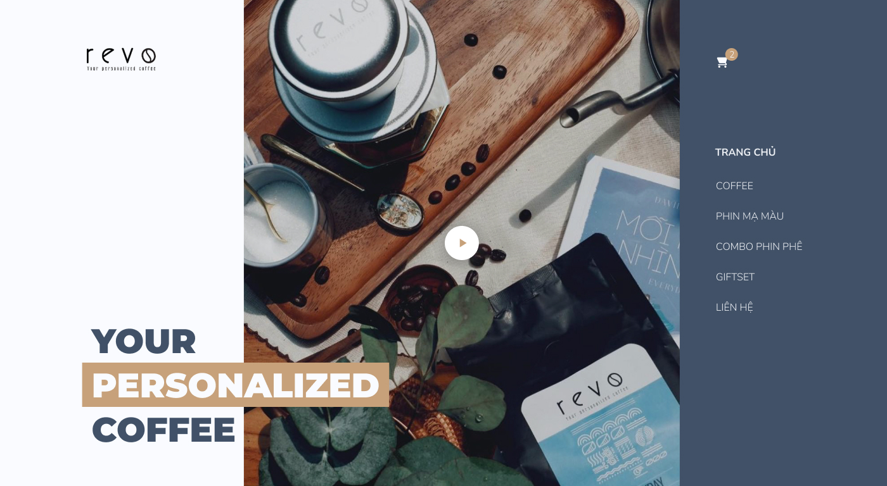

# Revo Coffee Landing

A landing page about coffee, showcasing its culture, taste, and atmosphere through a clean and modern design.

## 🖼️ Preview



## 🔗 Demo

**[View Online](https://szubyrka.github.io/revo-coffee-landing/)**

## 🚀 Features

- Pixel-perfect layout
- Semantic and accessible HTML5
- Modern CSS (Flexbox, Grid, animations)
- JavaScript-powered slider and tabs
- Static layout (no responsive design)

## 📁 Project Structure

```
├── index.html
├── assets/
│   ├── images/
│   ├── fonts/
│   └── styles/
├── README.md
└── LICENSE
```

## 🛠️ Technologies Used

- HTML5
- CSS3
- JavaScript

## 📌 Notes

- This project is created solely for educational and demonstration purposes.
- All images are taken from the [Figma design mockup](https://www.figma.com/file/sKegIQ17VCx3HZNj8pi0k4/Сайт-о-кофе?node-id=0%3A1&mode=dev).

## 📄 License

This project is licensed under the [MIT License](./LICENSE).

## 📬 Contacts

If you'd like to get in touch:

- GitHub: [@szubyrka](https://github.com/szubyrka)
- Email: [szubyrka@gmail.com](mailto:szubyrka@gmail.com)
